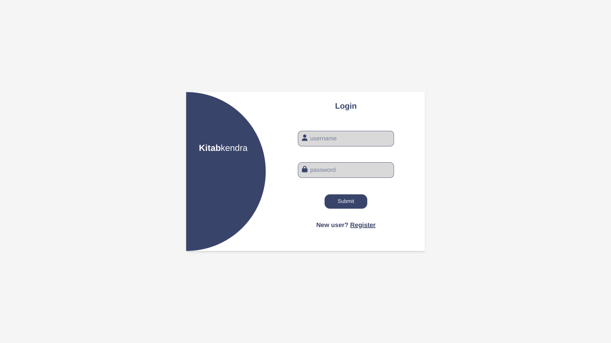
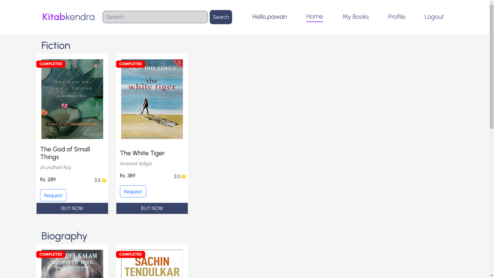
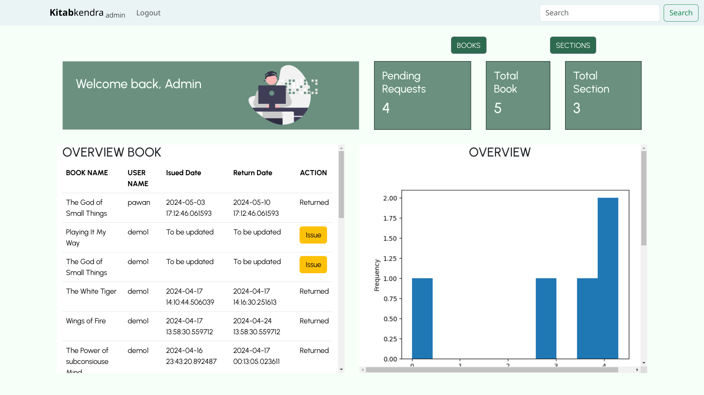

# KetabKendra

KetabKendra is a Library Management System web application designed to efficiently manage library resources. It facilitates tasks such as adding, removing, and editing books and sections within the library. Users can easily search for books and make requests through the application's intuitive interface.

## Table of Contents

- [Features](#features)
- [Technologies Used](#technologies-used)
- [Installation](#installation)
- [Usage](#usage)
- [Screenshots](#screenshots)
- [Project Contributions](#project-contributions)
- [Contributing](#contributing)
- [Contact](#contact)

## Features

- **User Authentication**: Implemented secure user authentication using Flask-Login.
- **CRUD Operations**: Enabled administrators to perform CRUD operations on books and sections for effective management.
- **Search Functionality**: Provided users with robust search capabilities to find books based on various criteria.
- **Request Management**: Facilitated users in making book requests and managed these requests efficiently.
- **Admin and User Dashboards**: Separate dashboards for admins and users, with the first registered user being assigned admin privileges.
- **Admin Functionality**: Admins have the ability to manage the entire library system, including adding, removing, and editing books and sections, approving or denying book requests, and managing user accounts.


## Technologies Used

- **Backend**: Flask, Flask-SQLAlchemy, Flask-Login, Flask-RESTful
- **Frontend**: HTML/CSS, Bootstrap
- **Database**: SQLite

## Installation

To run this project locally, follow these steps:

1. Clone the repository:
    ```bash
    git clone https://github.com/Zephyrr4/KetabKendra.git
    ```
2. Navigate to the project directory:
    ```bash
    cd KetabKendra
    ```
3. Create a virtual environment:
    ```bash
    python3 -m venv venv
    ```
4. Activate the virtual environment:
    - On Windows:
        ```bash
        venv\Scripts\activate
        ```
    - On macOS/Linux:
        ```bash
        source venv/bin/activate
        ```
5. Install the dependencies:
    ```bash
    pip install -r requirements.txt
    ```
6. Set up the database:
    - Start the Python shell:
        ```bash
        python
        ```
    - Run the following commands to create the database tables:
        ```python
        from app import db
        db.create_all()
        ```
7. Run the application:
    ```bash
    python app.py
    ```

## Usage

1. Open your web browser and go to `http://127.0.0.1:5000/`
2. Register a new user. The first registered user will be assigned admin privileges.
3. Admin users can access the admin dashboard to manage books and sections, while regular users can access the user dashboard to browse and request books.

## Screenshots

Here are some screenshots of the KetabKendra application to give you a visual overview of its interface:





## Project Contributions

I contributed to both frontend and backend development. On the frontend, I designed and implemented the user interface using HTML/CSS and Bootstrap, ensuring a intuitive design. For the backend, I leveraged Flask and Flask-SQLAlchemy to manage data and interactions with the SQLite database. This approach ensured seamless integration and smooth functionality across the application.

## Contributing

Contributions are welcome! Please follow these steps to contribute:

1. Fork the repository.
2. Create a new branch (`git checkout -b feature-branch`).
3. Make your changes.
4. Commit your changes (`git commit -m 'Add new feature'`).
5. Push to the branch (`git push origin feature-branch`).
6. Open a Pull Request.


## Contact

If you have any questions or suggestions, feel free to reach out.

- **Email**: itsmepawan.jh@gmail.com
- **GitHub**: [Zephyrr4](https://github.com/Zephyrr4)

---

Thank you for using KetabKendra!
